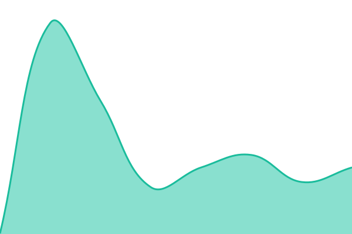
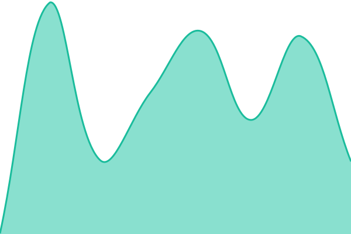
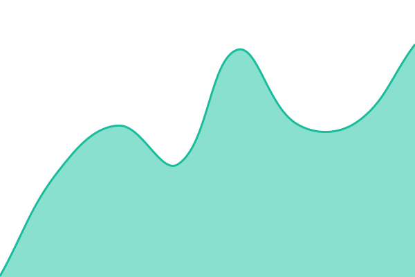
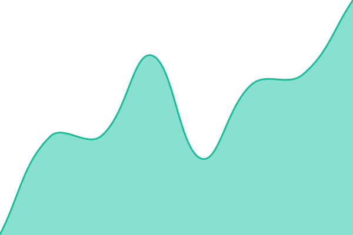

# [📈 Live Status](https://Orchestrator-AI-Systems.github.io/upptime): <!--live status--> **🟩 All systems operational**

This repository contains the open-source uptime monitor and status page for [Orchestrator AI Systems](https://Orchestrator-AI-Systems.github.io/upptime), powered by [Upptime](https://github.com/upptime/upptime).

With [Upptime](https://upptime.js.org), you can get your own unlimited and free uptime monitor and status page, powered entirely by a GitHub repository. We use [Issues](https://github.com/Orchestrator-AI-Systems/upptime/issues) as incident reports, [Actions](https://github.com/Orchestrator-AI-Systems/upptime/actions) as uptime monitors, and [Pages](https://Orchestrator-AI-Systems.github.io/upptime) for the status page.

<!--start: status pages-->
<!-- This summary is generated by Upptime (https://github.com/upptime/upptime) -->
<!-- Do not edit this manually, your changes will be overwritten -->
<!-- prettier-ignore -->
| URL | Status | History | Response Time | Uptime |
| --- | ------ | ------- | ------------- | ------ |
|  [Orchestrator (Marketing Site)](https://orchestrator.ca) | 🟩 Up | [orchestrator-marketing-site.yml](https://github.com/Orchestrator-AI-Systems/upptime/commits/HEAD/history/orchestrator-marketing-site.yml) | 

 221ms
     
 | 

<a href="https://status.orchestrator.ca/history/orchestrator-marketing-site">100.00%</a>
    

|  [Cadence](https://heycadence.ai) | 🟩 Up | [cadence.yml](https://github.com/Orchestrator-AI-Systems/upptime/commits/HEAD/history/cadence.yml) | 

 1085ms
     
 | 

<a href="https://status.orchestrator.ca/history/cadence">100.00%</a>
    

|  [Procexx](https://procexx.ai) | 🟩 Up | [procexx.yml](https://github.com/Orchestrator-AI-Systems/upptime/commits/HEAD/history/procexx.yml) | 

 147ms
     
 | 

<a href="https://status.orchestrator.ca/history/procexx">100.00%</a>
    

|  [FabricLab](https://fabriclab.ai) | 🟩 Up | [fabric-lab.yml](https://github.com/Orchestrator-AI-Systems/upptime/commits/HEAD/history/fabric-lab.yml) | 

 201ms
     
 | 

<a href="https://status.orchestrator.ca/history/fabric-lab">100.00%</a>
    

<!--end: status pages-->

[**Visit our status website →**](https://Orchestrator-AI-Systems.github.io/upptime)

## 📄 License

- Powered by: [Upptime](https://github.com/upptime/upptime)
- Code: [MIT](./LICENSE) © [Anand Chowdhary](https://anandchowdhary.com)
- Data in the `./history` directory: [Open Database License](https://opendatacommons.org/licenses/odbl/1-0/)
